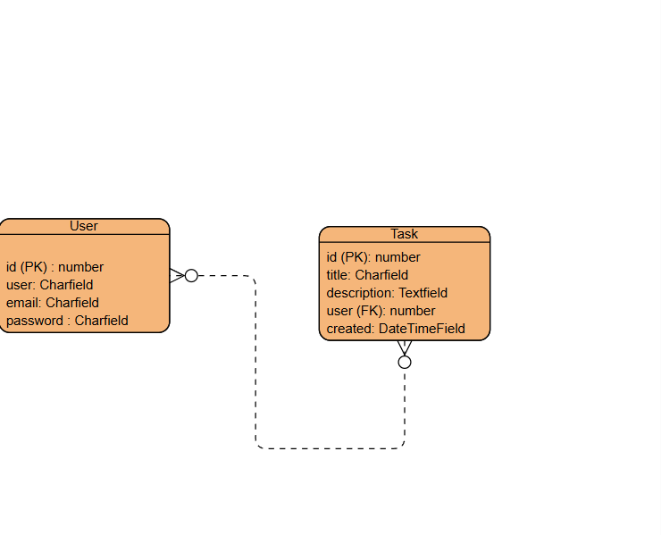
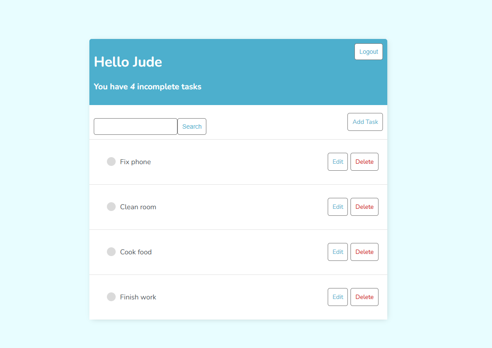
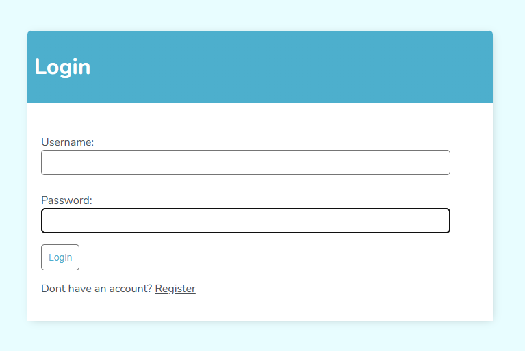
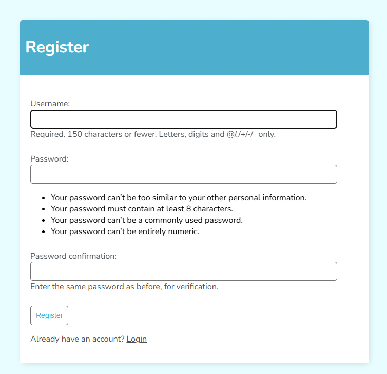
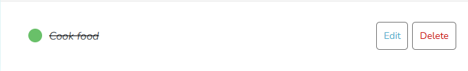
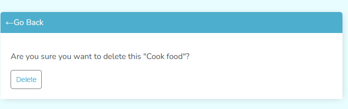
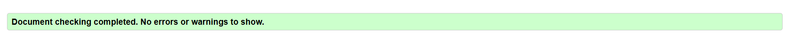
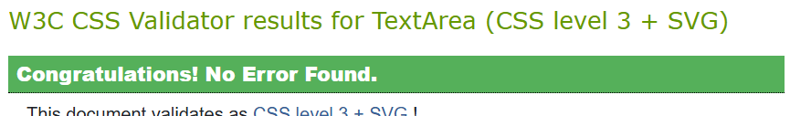
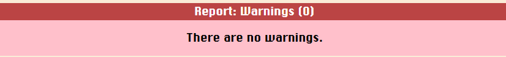
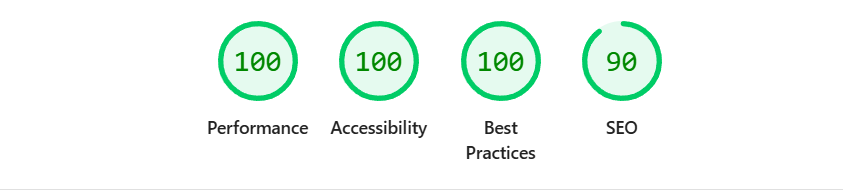

# Todo List

An app designed to track your tasks throughout the day.

<h1>Key Features:</h1>

<ol>
<li><b>User Authentication and Authorisation</b>:  Todo 4U contains user authentication and authorisation, providing a safe and secure way for users to create an account and produce tasks for their organisational needs. </li>
<li><b>CRUD Operations</b>: 
The Todo 4U application supports Create, Read, Update and Delete (CRUD) operations, allowing users to add,view,edit and delete tasks as they please.</li>
<li><b>User Friendly Design</b>: The Todo List features an intuitive design that makes for an easy and convenient user interface for our app visitors.</li>
<li><b>Editing</b>: 
The editing feature was implemented into the application to keep task information up to date without any hassle or frustration.</li>
<li><b>Responsive Design</b>: The app was created with a responsive design that can work on a variety of screen sizes and devices. </li>
</ol>

<h1>User Experience (UX):</h1>

<b>Site User:</b>

The main users of our app are people who are in need of an organisation tool, that gives people a place to track and maintain tasks that are important to the user, that also provides an efficient user experience.

<b>Goal:</b>

Todo 4U aim is to give people with organisation needs the best possible experience.By inserting key features like the ability to search for items and create, read, update and delete tasks when the user desires. The end goal for Todo 4U is to create a user-centered, mobile-friendly application that can simplify and keep track of tasks that need attention. 

<h1>Database Structure & Purpose:</h1>

<b>Overview:</b>

Todo 4U uses SQLite database to hold user and task information. The application has a simple database design prioritizing essential requirements of a task management framework that can maintain data integrity and user data separation. 

<h3><b>Core Models</b>:</h3>

<b>User Model (Django Built-in):</b>

TThe application uses Django's built in User model from django.contrib.auth.models.

<b>Fields:</b>

<ul>
<li>user (ForeignKey)</li>
<li>on_delete (CASCADE)</li>
<li>title (CharField)</li>
<li>description (TextField)</li>
<li>complete (BooleanField)</li>
<li>created (DateTimeField)</li>
</ul>

<b>Task Model:</b>

The task model shows the functions that will be used in the to-do lists system.

        class Task(models.Model):
               user = models.ForeignKey(User, on_delete=models.CASCADE, null=True, blank=True)
               title = models.CharField(max_length=200,)
              description = models.TextField(null=True, blank=True)
              complete = models.BooleanField(default=False)
              created = models.DateTimeField(auto_now_add=True)

                
          def   __str__(self):
            return self.title
         
            class Meta:
               ordering = ['complete']

<b>Task Model Fields:</b>

<ol>
<li>user</li>

<ul>
<li>Type: ForeignKey (references the User model) </li>
<li>On Delete: CASCADE (deletes a user task information)</li>
<li>Purpose: Links the task creations to the user who submitted them.</li>
</ul>

<li>title</li>

<ul>
<li>Type: CharField </li>
<li>Max Length: 200 characters</li>
<li>Allows the user to give their task a title for easier identification.</li>
</ul>

<li>description</li>

<ul>
<li>Type: TextField </li>
<li>Purpose: Stores a detailed description of the task created.</li>
</ul>

<li>complete</li> 

<ul>
<li>Type: BooleanField</li>
<li>Purpose: Allows the user to submit their task to the todo list once they have created the task information.</li>
</ul>

<li>created</li> 

<ul>
<li>Type: DateTimeField</li>
<li>Purpose: Tracks when the task entry was first added.</li>
</ul>

</ol>

<h1>Database Relationships:</h1>

The Entity Relationship Diagram was created with a mindset focused towards simplicity to make sure the Minimum Viable Product (MVP) criteria was met.

User (One) → Task (Many) One user can submit multiple tasks. Each task list belongs to an individual user.

<b>Key Points:</b>

<ol>
<li>One-to-Many Relationship:</li>

<ul>
<li>One user can have multiple tasks in the task list</li>
<li>Each task list belongs to one user</li>
<li>Relationship enforced through foreign key constraint</li>
</ul>

<li>Data Integrity:</li>

<ul>
<li>CASCADE deletion assures task is removed from list</li>
<li>Foreign key constraints maintain referential integrity</li>
</ul>

</ol>

<h1>Database Design Decisions</h1>

<ol>
<li>SQlite</li>

SQlite is a lightweight,fast, self-contained SQL database engine.This database is cross platform and has full ACID compliance. It has full SQL support. It includes JSON support and Window functions. SQLite is Django’s default database, meaning every new project starts with it automatically configured. Django’s ORM interacts with SQLite the same way it would with PostgreSQL or MySQL, so your model code doesn’t change. 

<li>Model Structure</li>

The structure of the tasks list follows a minimalistic design that was focused on the core MVP requirements to ensure an optimized and streamlined experience. The database structure is designed with ease in mind, emphasizing essential features such as, task creation, task updates and search capabilities. In regard to user authentication, the app leverages Django's built in authentication system. Creating a secure and flexible solution  for overseeing user registration and logins.

<li>Security Considerations</li>

 <ul>
 <li>User passwords protected by Django's auth system</li>
 <li>Foreign key relationships protect data integrity</li>
 <li>env and gitignore used to protect and hide sensitive keys and information.</li>

 </ul>

</ol>

<h3>Agile Methodology: Creating a Kanban Board on GitHub</h3>

For the development of Todo 4U, I used an Agile approach to make sure progress is constant and versatile as I go through the project. The main aspect of this style of development is the use of the Kanban board on Github Projects. The Kanban Board gives my clear vision of the features and requirements needed for my application to work correctly. 

<b>To Do:</b> The section for tasks that are about to be planned or started.  

<b>In Progress:</b> Objectives that are in the process of being completed will be placed in this section. 

<b>Done:</b> Any task that has been completed will be inserted into this category.

<b>Backlog:</b> This column is where tasks that have been listed but not prioritised for development are placed. 

<h2>User Stories:</h2>

User stories were an essential part of the developmental process of Todo 4U. Assuring that each feature was created to support the needs of the user. The user stories were arranged on the Kanban board, steering the process from idea to completion.

Example user story:

As a person in need of an application that helps organise my tasks. I want to sign up and log into an account, so I can create items and interact with the application.

Tasks:

Create a user authentication system with sign-up  and sign-in features.
    Create a sign-up form with fields for username and password.
   Apply password hashing for security.
    Set up a login form to authenticate existing users.
    Store user credentials securely in a database.
    Display a logged-in user's name and provide a "Log Out" button.
    Restrict review-related actions to logged-in users.

Acceptance criteria:

Users should be able to sign up with a unique username and password.
    Passwords must be securely hashed before storage.
    Users should be able to log in using their registered username and password.
    Logged-in users should see a personalized greeting (e.g., "Welcome, [username]").
    A "Log Out" button should be available and functional.

<h2>Design Principles:</h2>

<h3>Wireframes:</h3>

 To create a visualisation of the user experience. I designed the wireframes for desktop and mobile devices to show the intended layout.

<b>Desktop Wireframes:</b>

These desktop wireframes show the view of the application on larger screens. A desktop view provides a more detailed experience. It was designed to adapt to various screen sizes.

<b>Mobile Wireframes:</b>

The mobile wireframes are designed for screens that are smaller and have touch screen navigation. It focuses on simplicity and utility.

                                 

                                 

                                 

<h3>Colour Scheme:</h3>

The colour scheme of the project was planned during the early stages of development. I decided to go with this scheme because it created a minimalistic and calm aesthetic for the website which was the objective in the beginning. 

<h3>Primary colours:</h3>

<ul>
<li>blue (#4dafcd): I decided to choose  blue for the colour scheme of the application because it aligned with the original idea of the project. I wanted a minimalist style to avoid the todo list being overwhelmed by a clashing of colours that hindered the user experience. Blue seemed to be the best fit for what I had planned for the project. </li>

<li>light cyan (#e8fdff): Light cyan seemed to be the best choice for the background of the application to compliment the blue and white colours used in the project. Enhancing the welcoming aesthetic for the project.
</li>

</ul>

<h2>Features:</h2>

<h3>Templates:</h3>

<b>Base Template(main.html):</b>

The base template creates a foundation for the applications design and layout, including the button placement,task content area and user identification text.

<b>Main Content:</b>

The main content area contains:

<ul>
<li><b>Search Bar:</b> The search bar allows users to look for a specific task they have entered into their to-do list.</li>

<li><b>Hello User:</b> I created a system that can identify who is currently logged in to the to-do list, by giving the user a greeting once they enter the main page.</li>

<li><b>Logout Button:</b> I created a logout button that allows users to quickly leave their todo list whenever they require it.
</li>

<li><b>Task Area:</b> The main page contains a task area to show the user what tasks they have on their todo list.</li>

<li><b>Edit and Delete button:</b> I implemented an edit and delete button to allow for easy navigation to different locations of the application.</li>

<li><b>Add Task button:</b>The add task button was created to make the application experience as efficient as possible for the user.</li>

<li><b>Task Tracker:</b> The task tracker was made to easily convey to the user how many incomplete tasks they have in their todo list at the moment.
</li>

</ul>

<b>Login Template(login.html):</b>

<b>Register Template(register.html):</b>

<b>Task Form Template(task_form.html):</b>

<b>Main Content:</b>

The main content area contains:

<ul>
<li><b>Title Section:</b> The task form page has a title section to allow users to name their task in a convenient manner.</li>

<li><b>Description Section:</b> The task form page also allows users to go into more details about the specifics of the task they are trying to complete.</li>

<li><b>Complete Button:</b> Once the user feels their task has been completed, they can click the complete button at the bottom of the task form page and it will put a line through the task and a green dot will appear next to the finished task.
</li>

</ul>

<b>Task Delete Template(task_confirm_delete.html):</b>

<h2>AI:</h2>

<h3>Collaboration:</h3>

Throughout the project I used AI (Copilot) to assist me in the creation of Todo 4U.Copilot was a collaborator to support me at different points of the applications development. Using AI made the creation of the application a more efficient process. It also helped me improve and learn better practices when coding thanks to AIs real-time feedback.

<h3>Debugging:</h3>

AI was very important in the debugging stages of the project, it helped to identify issues and errors whilst giving me helpful solutions when necessary.During the debugging phase I used Copilot to help me fix errors and mistakes, which might have consumed a significant amount of development time. This allowed me to progress through the debugging process with a little less confusion and frustration. 

<h2>Testing and Validation:</h2>

<h3>HTML Validation:</h3>

All HTML use in the project was validated using the W3C Markup Validation Service.

login.html Validation

main.html Validation

register.html Validation

task_confirm_delete.html Validation

task_form.html Validation

task_list.html Validation

task.html Validation

<h3>CSS Validation:</h3>

The CSS used in the project was validated with W3C CSS Validation Service.

main.css Validation

<h3>Javascript Validation:</h3>

The Javascript used in the project was validated with JSLint.com.

main.js Validation

<h2>Tests:</h2>

<h3>Responsiveness Test:</h3>

I carried out a responsiveness test using the Google Lighthouse accessibility features. To analyse how well my application is running.

<h3>Account Signup, Login, Logout, and Access Tests:</h3>

<table style=" border: 1px solid black;">
  <tr style=" border: 1px solid black;">
    <th style=" border: 1px solid black;">Feature</th>
    <th style=" border: 1px solid black;">Test Case</th>
    <th style=" border: 1px solid black;">Expected Result</th>
    <th style=" border: 1px solid black;">Result</th>
  </tr>
  <tr style=" border: 1px solid black;">
    <td style=" border: 1px solid black;">User Registration</td>
    <td style=" border: 1px solid black;">Navigate to the registration page. Fill in the form with valid details and submit.</td>
    <td style=" border: 1px solid black;">The user is registered and redirected to the to-do list page.</td>
    <td style=" border: 1px solid black;">PASS</td>
  </tr>
  <tr style=" border: 1px solid black;">
    <td></td>
    <td style=" border: 1px solid black;">
Attempt to register with an existing username. Also attempt to register with passwords that do not match.</td>
    <td style=" border: 1px solid black;">An appropriate error message is displayed.</td>
    <td style=" border: 1px solid black;">PASS</td>
  </tr>
   <tr style=" border: 1px solid black;">
    <td style=" border: 1px solid black;">User Login</td>
    <td style=" border: 1px solid black;">Navigate to the login page. Fill in the form with valid credentials and submit.</td>
    <td style=" border: 1px solid black;">User is logged in and redirected to the to-do list page.</td>
    <td style=" border: 1px solid black;">PASS</td>
  </tr>
   <tr style=" border: 1px solid black;">
    <td></td>
    <td style=" border: 1px solid black;">Attempt to log in with invalid credentials.</td>
    <td>An appropriate error message is displayed</td>
    <td style=" border: 1px solid black;">PASS</td>
  </tr>
   <tr style=" border: 1px solid black;">
    <td style=" border: 1px solid black;">User Logout</td>
    <td style=" border: 1px solid black;">While logged in, click the logout button.</td>
    <td style=" border: 1px solid black;">User is logged out and redirected to the login page.</td>
    <td style=" border: 1px solid black;">PASS</td>
  </tr>
  <tr style=" border: 1px solid black;">
    <td style=" border: 1px solid black;">Create Task</td>
    <td style=" border: 1px solid black;">Click the "Add Task" button. Fill in the form with valid details and submit.</td>
    <td style=" border: 1px solid black;">Task is created and displayed in the task list.</td>
    <td style=" border: 1px solid black;">PASS</td>
  </tr>
   <tr style=" border: 1px solid black;">
    <td style=" border: 1px solid black;">Edit Task</td>
    <td style=" border: 1px solid black;">Click the "Edit" button for an existing task. Modify the details and submit.</td>
    <td style=" border: 1px solid black;">Task is updated and changes are reflected in the task list.</td>
    <td style=" border: 1px solid black;">PASS</td>
  </tr>
  <tr style=" border: 1px solid black;">
    <td style=" border: 1px solid black;">Delete Task</td>
    <td style=" border: 1px solid black;">Click the "Delete" button for an existing task. Confirm the deletion in the task list.</td>
    <td style=" border: 1px solid black;">Task is removed from the task list.</td>
    <td>PASS</td>
  </tr>
  <tr style=" border: 1px solid black;">
    <td style=" border: 1px solid black;">Search Task</td>
    <td style=" border: 1px solid black;"  >Click the "Search" button for an existing task. Confirm the search filtered all irrelevant tasks.</td>
    <td style=" border: 1px solid black;">Only relevant tasks is appear in the task list.</td>
    <td style=" border: 1px solid black;">PASS</td>
  </tr>
</table>

<h3>Deployment:</h3>

The repo was created in Github.

To deploy the project to Heroku you must first push your finished project code to Github.Without any secret keys or sensitive information.

Once you have logged in to your account.There should be a dot square in the right corner of the screen.

Click the dots and you should see a dropdown menu with a panel called "Dashboard".Click it and you should be directed to another page.

Once you have arrived at the next page click the button "New" in the right corner.A small menu should drop down and show the words "Create an app".Click the button.

                          

Fill out the create an app form and click the "Create app button". This should complete the app creation process.

The app was deployed on the <a href="https://jamal-todo1-dd2d34670e9f.herokuapp.com/">Heroku Page</a>

<h2>Credits and References</h2>

I used the previous walkthrough modules to help me in understanding what I needed to do to complete this project.

I also used a youtube tutorial to help me understand how to structure my to-do list in a productive way.

Link to the <a href="https://www.youtube.com/watch?v=fBgdS7oqnyE">Tutorial</a>

